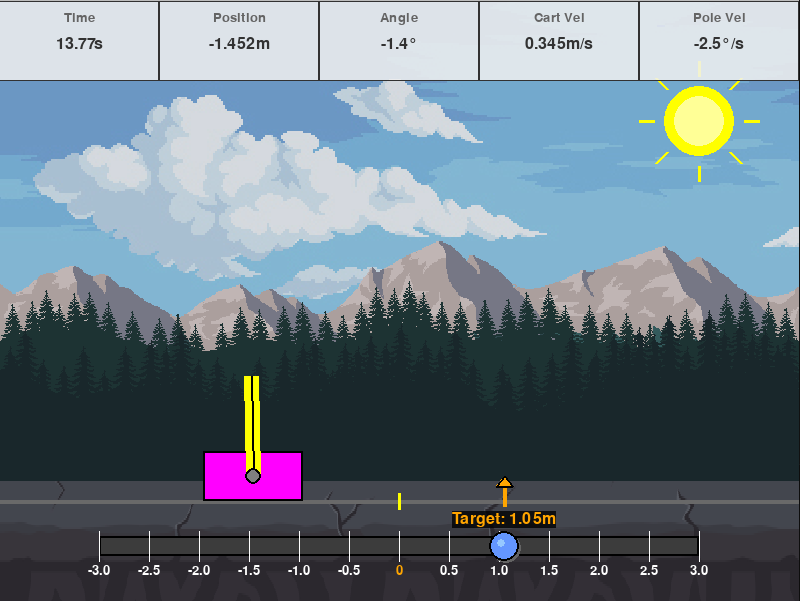
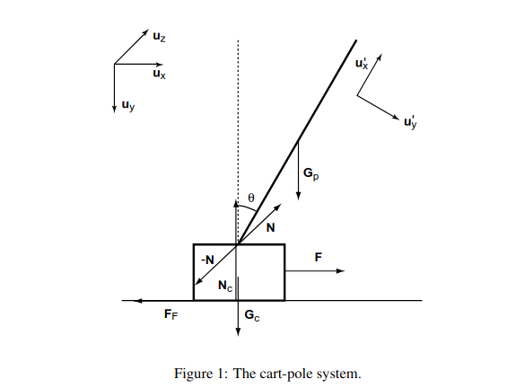
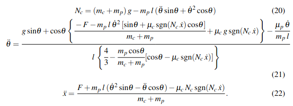
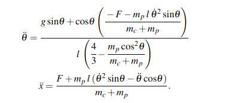
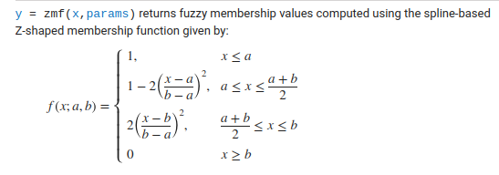
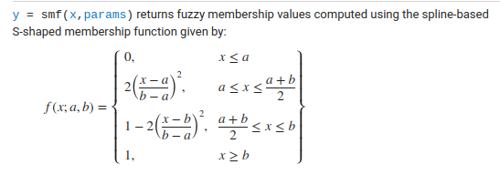
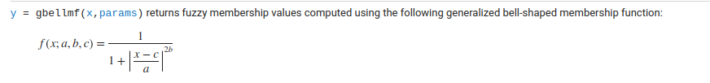
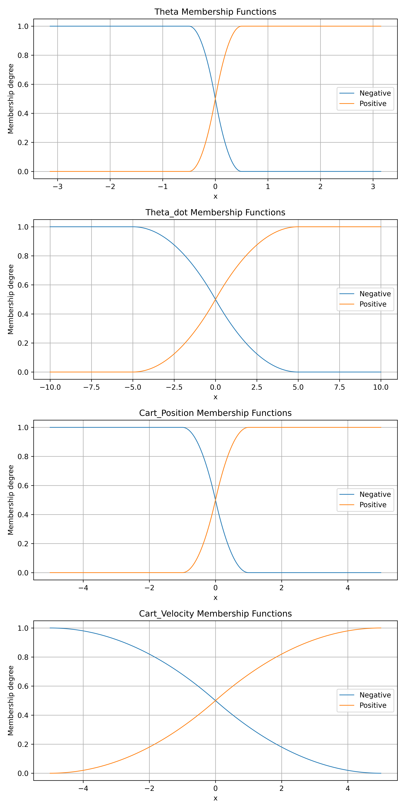
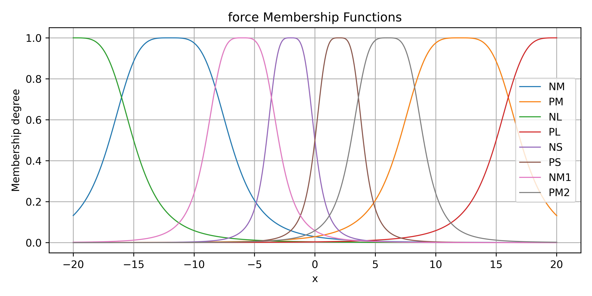
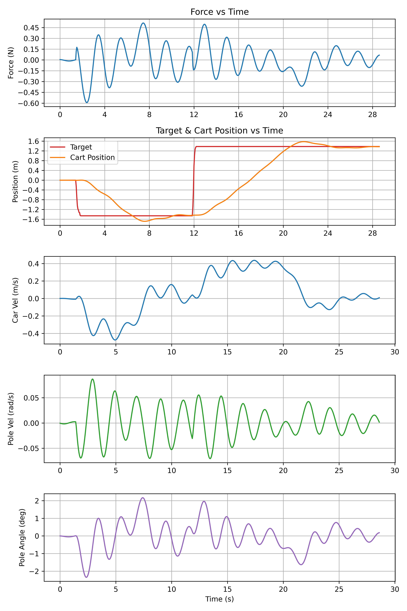

# CartPole Controller Using Fuzzy Logic

<p align="center">
  
</p>

In this project, we developed a **custom fuzzy logic library in Python** and used it to implement a **Fuzzy Logic Controller (FLC)** to balance a pole on a moving cart. Additionally, we created a **real-time visualizer using Pygame** to display the cart-pole states during simulation.  

The cart-pole dynamics are modeled based on the paper [*“Correct equations for the dynamics of the cart-pole system”*](https://coneural.org/florian/papers/05_cart_pole.pdf).  

<p align="center">
  
</p>

---

## CartPole Dynamics

**With friction consideration:**  

<p align="center">
  
</p>

**Without friction consideration:**  

<p align="center">
  
</p>

---

## Membership Function Types

**Zmf**  
<p align="center">
  
</p>

**Smf**  
<p align="center">
  
</p>

**Gbellmf**  
<p align="center">
  
</p>

---

## Inputs and Outputs to the Controller

**Inputs:**  
- Pole angle (θ)  
- Pole angular velocity (θ̇)  
- Cart position (x)  
- Cart velocity (ẋ)  

**Output:**  
- Force (f)  

---

## Fuzzification

**Input Membership Functions:**  

<p align="center">
  
</p>

---

## Defuzzification

**Output Membership Functions:**  

<p align="center">
  
</p>

---
## Result
<p align="center">
  
</p>

<p align="center">
  
</p>

---
## Usage

```bash
pip install numpy matplotlib pygame
```

```bash
python3 main.py
```

---

## References

- Florian, “Correct equations for the dynamics of the cart-pole system”, [Link](https://coneural.org/florian/papers/05_cart_pole.pdf)  
- Matlab Fuzzy Inference System Modeling , [Link](https://www.mathworks.com/help/fuzzy/fuzzy-inference-system-modeling.html?s_tid=CRUX_topnav)
- Pygame, [Link](https://www.pygame.org/wiki/about)
